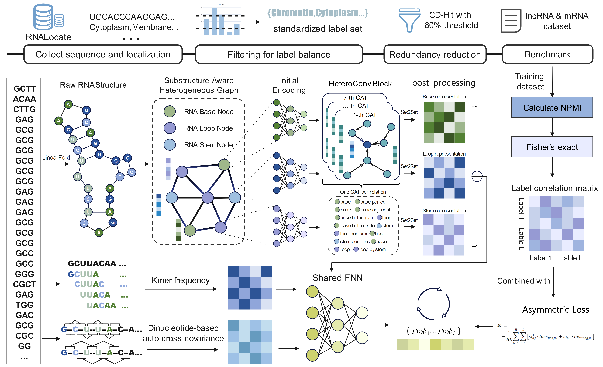

# GRASP: RNA Subcellular Localization Prediction

## Introduction

We propose a unified graph neural network–based framework for RNA subcellular localization prediction, named **GRASP**, which is applicable to both lncRNAs and mRNAs. The framework adopts an **RNA substructure-aware heterogeneous graph** modeling strategy: RNA molecules are represented using nucleotide nodes together with secondary-structure-derived substructure nodes (e.g. loops and stems) and their associated relational edges, enabling joint modeling of base-level interactions and regional structural context for multi-label localization prediction.

**Main pipeline:**

1. **Feature extraction**: Extract **Kmer frequency**, **DACC** (dinucleotide auto-cross covariance), and **LinearFold**-predicted secondary structure from RNA sequences.
2. **Graph representation**: Build a substructure-aware heterogeneous graph from LinearFold dot-bracket notation (base, loop, and stem nodes with multiple edge types).
3. **Model**: GAT convolution on the heterogeneous graph (implemented in `data_hetero` + `model_hetero`) with sequence-derived features to output multi-label probabilities.



### Environment Setup

Package versions are aligned with the lnctracker environment. Recommended steps:

**Step 1 — Create and activate the conda environment**

```bash
conda env create -f environment.yml
conda activate grasp
```

**Step 2 — Install PyTorch with CUDA 11.7 (GPU)**

If you need a GPU build or the conda-installed PyTorch fails (e.g. `undefined symbol: iJIT_NotifyEvent`), reinstall PyTorch via pip:

```bash
pip install torch==2.0.1+cu117 torchvision==0.15.2+cu117 torchaudio==2.0.2+cu117 --extra-index-url https://download.pytorch.org/whl/cu117
```

**Step 3 — Install torch-scatter (must match PyTorch 2.0 and CUDA 11.7)**

```bash
pip install torch-scatter -f https://data.pyg.org/whl/torch-2.0.0+cu117.html
```

For **CPU-only** PyTorch, use the `+cpu` wheel index instead (e.g. `torch-2.0.0+cpu`).

### Reference files (LinearFold & DACC)

All tools needed for feature extraction are under **`reference/`**:

- **`reference/linearfold_v`** — LinearFold executable for secondary structure prediction. If present, it is used by default (no need to set `--linearfold_cwd`).
- **`reference/ilearn/`** — DACC (iLearn) modules and data: `descnucleotide/`, `pubscripts/`, `data/dirnaPhyche.data`. Used by default for DACC; override with `--ilearn_dir` if needed.

### Quick Start

After cloning or entering the project directory, use `run_train.py` for training and `run_predict.py` for prediction. Training is split by RNA type (lncRNA / mRNA) for separate models and checkpoints.

---

## Training

Training uses **data_hetero** (heterogeneous graph dataset) and **model_hetero** (RNAHeteroModel). Three feature types are used: **Kmer**, **DACC**, and **LinearFold**. Feature files are named by the **FASTA base name + feature type** (e.g. for `lncRNA_6k_8loc.fasta`: `lncRNA_6k_8loc_linearfold.pkl`, `lncRNA_6k_8loc_5mer.pkl`, `lncRNA_6k_8loc_dacc.pkl`). They are cached under `--feature_dir` and reloaded in later runs. Cached graphs are stored under `--data_prepared_root` with names like `{base_name}_hetero_fold_{fold_idx}_{data_version}`. The **tokenizer** and **mlb_classes** are saved under `{checkpoint_folder}/{rna_type}/` for prediction.

```bash
# lncRNA model (default)
python run_train.py \
  --input_path ./data/lncRNA_6k_8loc.fasta \
  --rna_type lncRNA \
  --feature_dir ./features \
  --checkpoint_folder ./model_saved \
  --device cuda:0

# mRNA model
python run_train.py \
  --input_path ./data/mRNA_24k_8loc.fasta \
  --rna_type mRNA \
  --checkpoint_folder ./model_saved \
  --device cuda:0
```

**Input FASTA format**: One header line and one sequence line per record; the last field in the header is the label (comma-separated for multi-label).

```text
>seq_id|nucleus,cytoplasm
AUGCCUAG...
```

**Main arguments:**

| Argument | Description | Default |
|----------|-------------|---------|
| `--input_path` | Path to training FASTA | Required |
| `--rna_type` | RNA type for naming: `lncRNA` or `mRNA` | `lncRNA` |
| `--feature_dir` | Directory for cached features (linearfold/kmer/dacc pkl) | `./features` |
| `--data_prepared_root` | Root directory for cached graph data | `./data_prepared` |
| `--checkpoint_folder` | Root to save model and tokenizer; actual path is `{checkpoint_folder}/{rna_type}/` | `./model_saved` |
| `--batch_size` | Batch size | 32 |
| `--learningrate` | Learning rate | 0.001 |
| `--epochs` | Maximum number of epochs | 200 |
| `--patience` | Early stopping patience | 20 |
| `--k_folds` | Number of cross-validation folds | 5 |
| `--kmer_k` | Kmer length | 5 |
| `--dacc_lag` | DACC lag | 2 |
| `--isMultiLabel` | Multi-label task | True |
| `--isAutoThres` | Use automatic threshold | False |
| `--device` | Device (e.g. `cuda:0` or `cpu`) | `cuda:0` |
| `--linearfold_cwd` | Directory containing `linearfold_v` (default: `reference/` if present) | - |
| `--ilearn_dir` | Root for DACC (default: `reference/ilearn`) | - |
| `--data_version` | Suffix for cached graph dataset names | `hetero_v1` |

After training, the best model is saved as `model_best_auc_*.pth` and also as **`model_4lncRNA.pth`** / **`model_4mRNA.pth`** (used by prediction by default). `tokenizer.pkl` and `mlb_classes.txt` are saved under `{checkpoint_folder}/{rna_type}/` (e.g. `./model_saved/lncRNA/`).

---

## Prediction

Prediction uses **data_hetero** and **model_hetero** (same as training). It accepts **unlabeled FASTA only** (headers can be `>id` or `>id|...`; labels are ignored). Specify **`--rna_type`** (lncRNA or mRNA) to load the correct checkpoint from `{checkpoint_folder}/{rna_type}/`. The script loads **tokenizer.pkl** and **mlb_classes** for the output CSV. Feature files are looked up by input FASTA base name (e.g. `lncRNA_test_linearfold.pkl` for `lncRNA_test.fasta`). When `--model_path` is not set, it loads **`model_4lncRNA.pth`** or **`model_4mRNA.pth`** in that folder. **After prediction, the generated feature files for this input (linearfold, kmer, dacc pkl) are deleted** to avoid leaving temporary files.

```bash
# lncRNA (default)
python run_predict.py \
  --input_path ./data/lncRNA_test.fasta \
  --output_path ./results/lnc_predictions.csv \
  --rna_type lncRNA \
  --checkpoint_folder ./model_saved \
  --device cuda:0

# mRNA
python run_predict.py \
  --input_path ./data/mRNA_test.fasta \
  --output_path ./results/m_predictions.csv \
  --rna_type mRNA \
  --checkpoint_folder ./model_saved \
  --device cuda:0
```

**Main arguments:**

| Argument | Description | Default |
|----------|-------------|---------|
| `--input_path` | Input FASTA to predict (unlabeled) | Required |
| `--output_path` | Output CSV path | Required |
| `--rna_type` | RNA type: `lncRNA` or `mRNA`; checkpoint path is `{checkpoint_folder}/{rna_type}/` | `lncRNA` |
| `--checkpoint_folder` | Root folder for checkpoints; actual path is `{checkpoint_folder}/{rna_type}/` | `./model_saved` |
| `--model_path` | Path to model `.pth`; if omitted, auto-selected from checkpoint by rna_type | - |
| `--feature_dir` | Feature cache directory (should match training) | `./features` |
| `--batch_size` | Batch size | 32 |
| `--kmer_k` | Kmer length (must match training) | 5 |
| `--dacc_lag` | DACC lag (must match training) | 2 |
| `--isMultiLabel` | Multi-label task | True |
| `--thres` | Binary prediction threshold (when `isAutoThres=False`) | 0.5 |
| `--device` | Device | `cuda:0` |
| `--linearfold_cwd` | Directory containing `linearfold_v` (default: `reference/` if present) | - |
| `--ilearn_dir` | Root for DACC (default: `reference/ilearn`) | - |
| `--data_version` | Suffix for cached graph dataset (must match training if reusing) | `hetero_v1` |

The output CSV has header `Type, Seq_ID, label1, label2, ...` and for each sample a **Prob** row (probabilities) and a **Binary** row (0/1 predictions).

---

## Features

- **Kmer**: k-mer frequency (default k=5), normalized and used as sequence features.
- **DACC**: Dinucleotide auto- and cross-covariance; implementation uses the iLearn-style DACC (RNA: 6 physicochemical indices, lag=2). Required files are under `reference/ilearn/` (see above).
- **LinearFold**: Predicts RNA secondary structure (dot-bracket) and is used to build the heterogeneous graph (base–loop–stem and pairing/adjacency relations). The executable is `reference/linearfold_v`.

---

## Directory structure

```text
GRASP_Github/
├── run_train.py       # Training entry (data_hetero + model_hetero; Kmer, DACC, LinearFold)
├── run_predict.py     # Prediction entry (unlabeled FASTA; deletes generated features after run)
├── run_hetero.py      # Reference script (same hetero config, hardcoded paths)
├── data_hetero.py     # Heterogeneous graph dataset (RNAHeteroGraphDataset, hetero_collate_func)
├── model_hetero.py    # RNAHeteroModel, train_valid, valid_step, AsymmetricLoss
├── data_2.py          # SequenceTokenizer (used by data_hetero and run_predict)
├── utils.py           # FASTA I/O, Kmer, LinearFold, DACC, split_dataset_ensure_label, etc.
├── metrics.py         # Multi-label evaluation metrics
├── environment.yml    # Conda environment
├── reference/         # LinearFold and DACC (iLearn) — used by default
│   ├── linearfold_v   # LinearFold executable
│   └── ilearn/        # DACC: descnucleotide, pubscripts, data/
├── data/              # Example FASTA (e.g. lncRNA_6k_8loc.fasta, mRNA_24k_8loc.fasta)
├── features/          # Feature cache (linearfold/kmer/dacc pkl; prediction removes its own after run)
├── data_prepared/     # Cached heterogeneous graphs (processed/*.pt)
├── model_saved/       # Checkpoints per rna_type
│   ├── lncRNA/        # tokenizer.pkl, mlb_classes.txt, model_4lncRNA.pth, model_best_auc_*.pth
│   └── mRNA/          # tokenizer.pkl, mlb_classes.txt, model_4mRNA.pth, model_best_auc_*.pth
└── results/           # Prediction output CSV (optional)
```

---

## Dependencies and installation

- **Conda + pip**: Follow **Environment Setup** above. The `environment.yml` installs Python, PyTorch (conda), and other conda/pip packages; for a reliable GPU setup, Steps 2–3 (pip PyTorch + torch-scatter) are recommended.
- **PyTorch**: For CUDA 11.7 use the pip command in Step 2. For other CUDA versions, see [PyTorch Get Started](https://pytorch.org/get-started/locally/).
- **torch-scatter**: Must match your PyTorch and CUDA. Use the Step 3 command for PyTorch 2.0 + cu117; for other builds, use:
  ```bash
  pip install torch-scatter -f https://data.pyg.org/whl/torch-${TORCH}+${CUDA}.html
  ```
  (e.g. `${TORCH}=2.0.0`, `${CUDA}=cpu` or `cu118`).
- **LinearFold**: The executable `linearfold_v` is under `reference/` and is used by default; otherwise set `--linearfold_cwd`.
- **DACC**: Uses `reference/ilearn/` by default; override with `--ilearn_dir` if needed.
